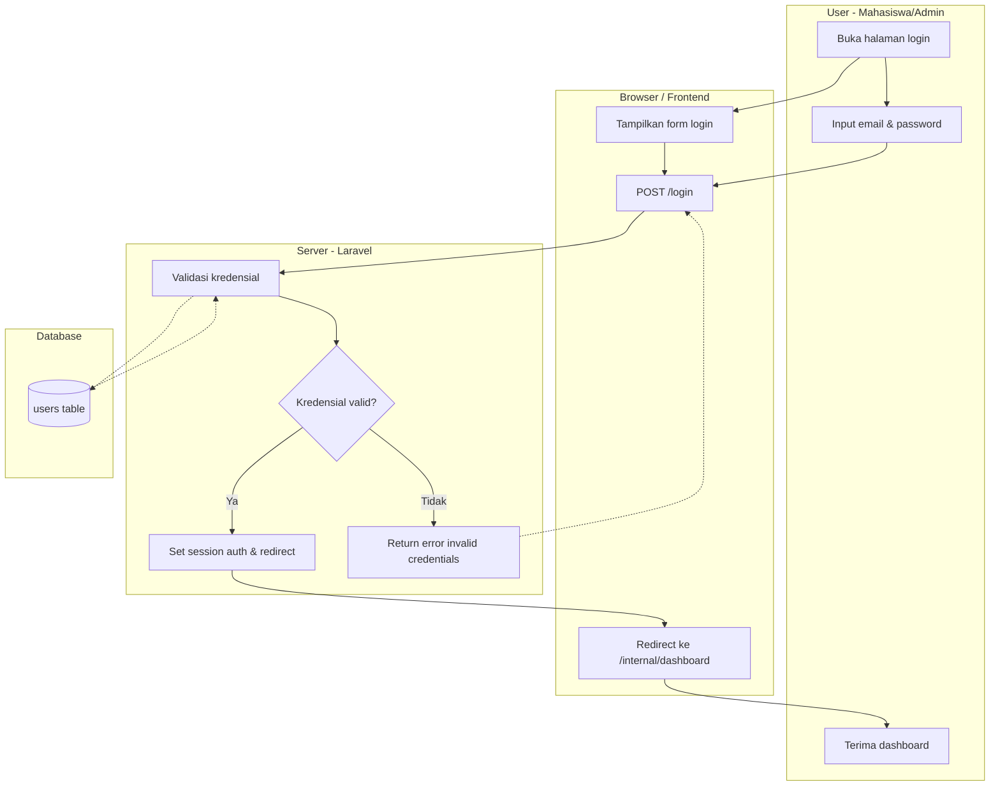
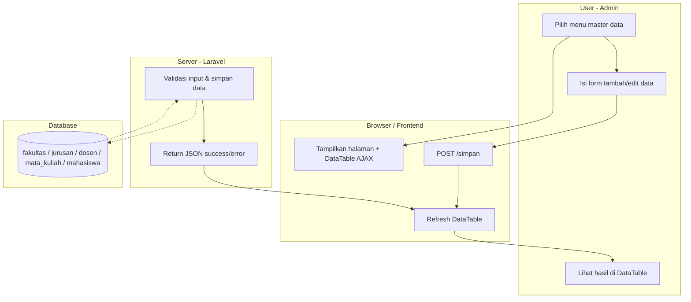
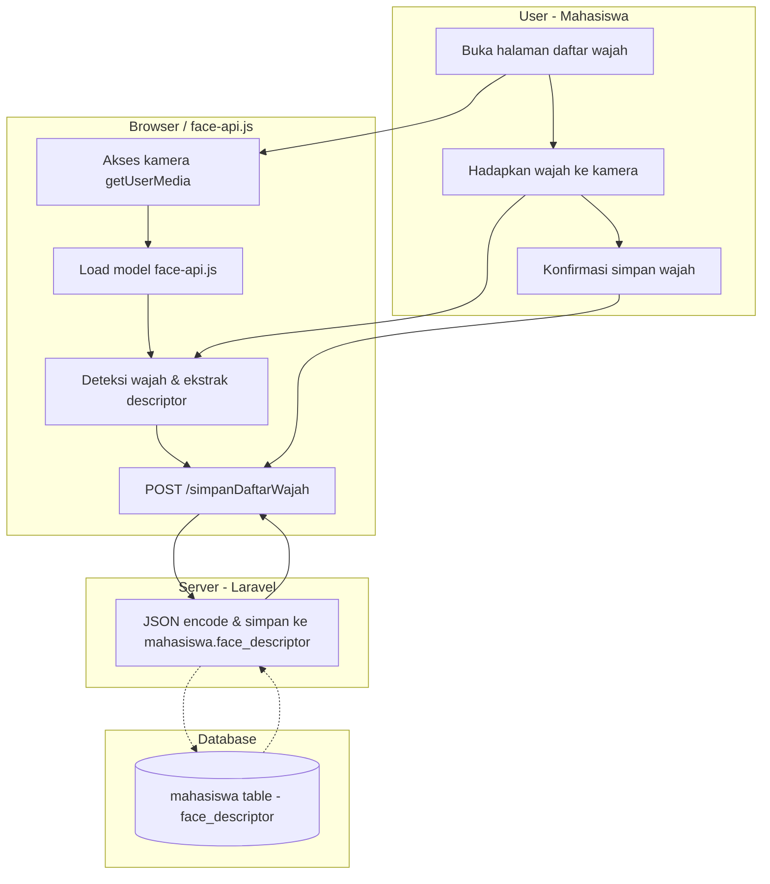
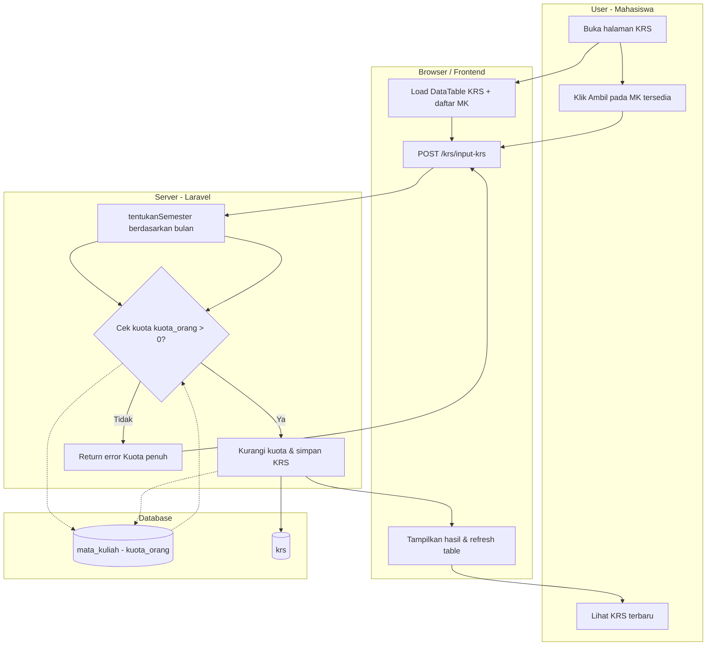
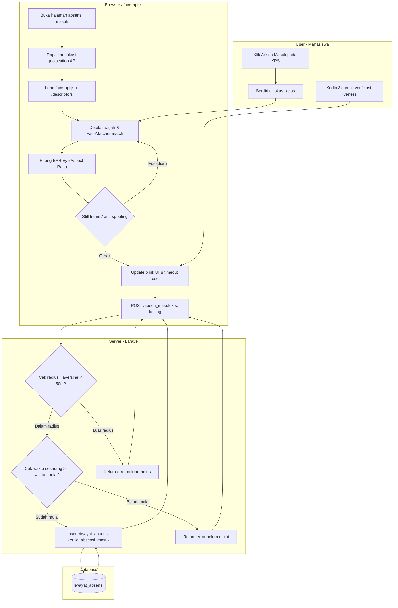
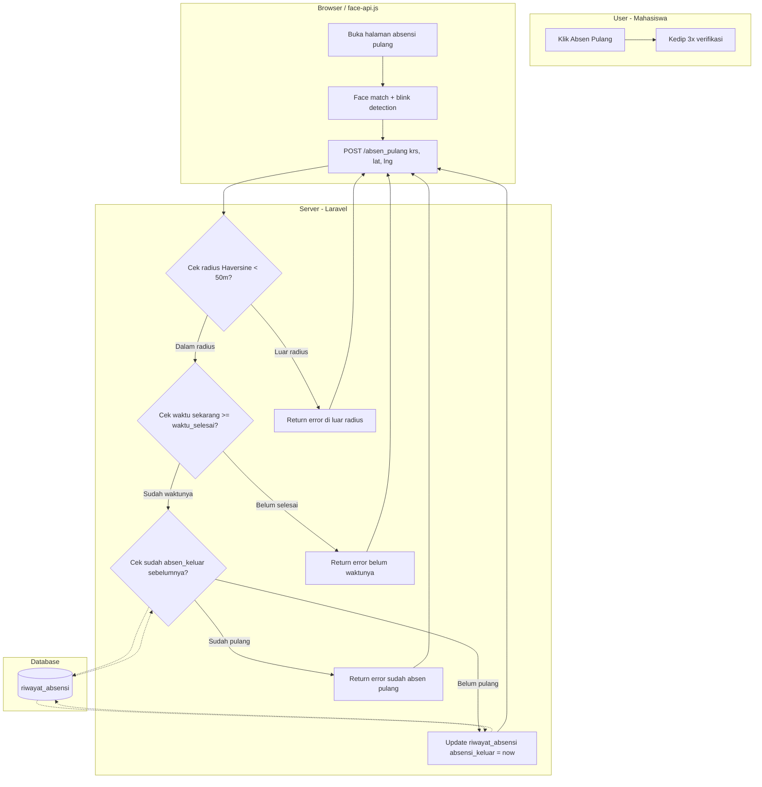

# Flowchart Sistem Project-PI

## 1. Login & Auth

## 2. Admin CRUD Master Data

## 3. Pendaftaran Wajah (Face Registration)

## 4. KRS (Course Registration)

## 5. Absen Masuk

## 6. Absen Pulang

